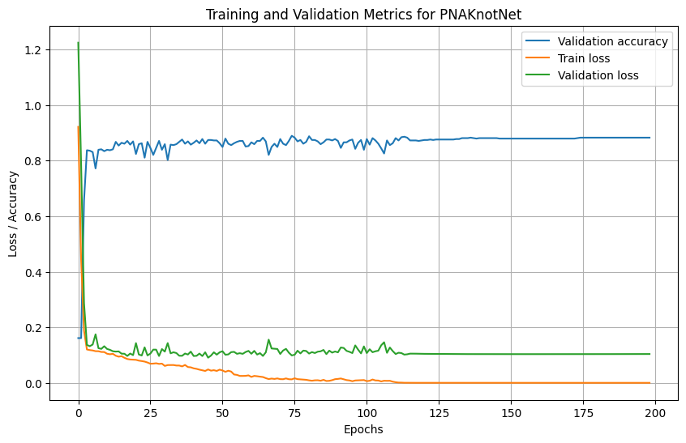
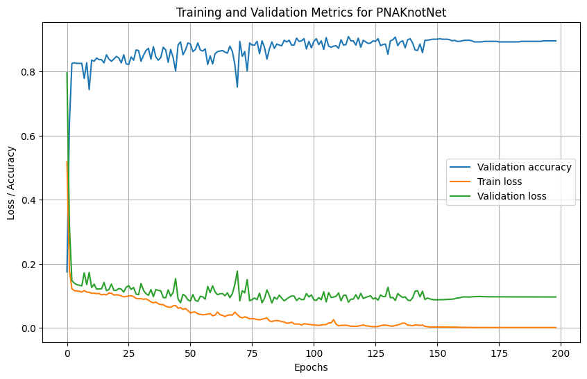
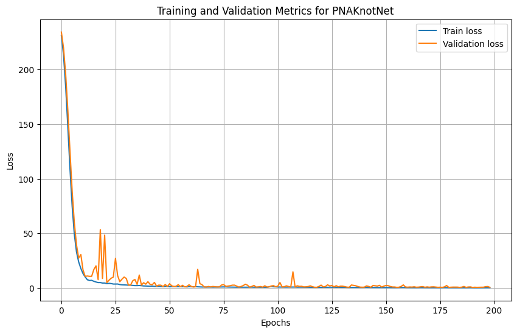
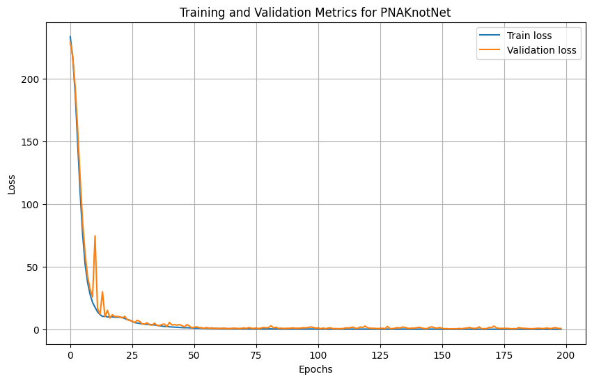

# Predict Q-Positive

Predecir esta variable era la configuración por defecto de la red neuronal cuando descargamos los archivos. Utiliza tres posibles arquitecturas: PNAConv (pudo ejectuarse sin problema alguno con batches de 128), GATConv (tiene problemas de memoria; requiere optimizar el uso de memoría en entrenamiento), y TransformerConv (da problemas relacionados al tamaño de las entradas y salidas de las capas; no hacen match).

## PNA Convolutional Graph Network

Parece dar buenos resultados. El aprendizaje se detiene apróximadamente en la época 115, con un accuracy en test del 90% (sesgado dada la distribución favorable de los datos hacia la clase positiva).

# Predict Hyperbolic Volume

## PNA Convolutional Graph Network

